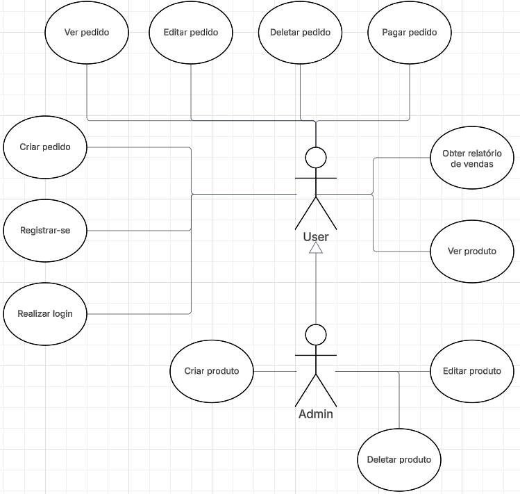
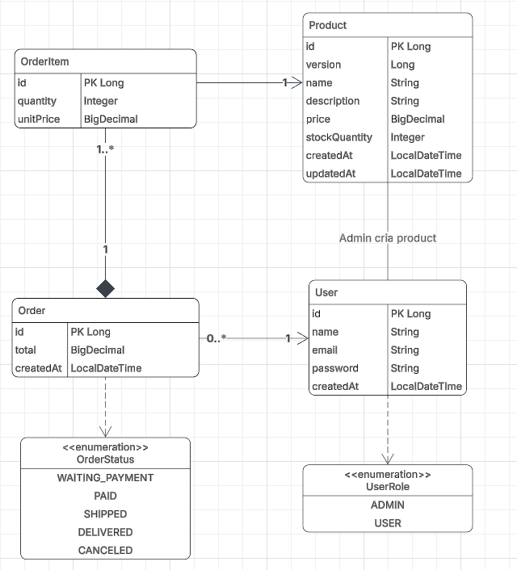
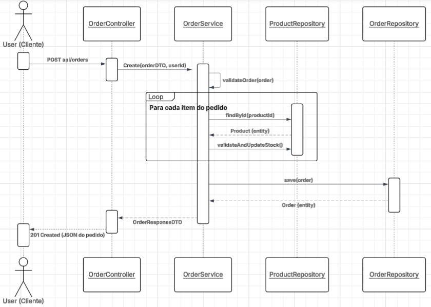

# 🛒 Spring Store API (v2.0)

API RESTful robusta para e-commerce, desenvolvida com **Spring Boot 3.4** e **Java 21**.
Este projeto demonstra a implementação de uma arquitetura Enterprise, focada em escalabilidade, segurança e integridade de dados.

## 🚀 Tecnologias & Stack

* **Core:** Java 21 LTS, Spring Boot 3.4
* **Dados:** Spring Data JPA, PostgreSQL (Prod), H2 (Dev)
* **Segurança:** Spring Security, JWT (Stateless), OAuth2 (Google Client)
* **Testes:** JUnit 5, Mockito
* **Doc:** OpenAPI (Swagger UI)
* **Infra:** Docker, Docker Compose
* **Lombok** (Produtividade)

## 🏗️ Funcionalidades & Arquitetura

### 🛡️ Segurança Híbrida (Hybrid Auth)
* **Múltiplos métodos de autenticação:** Suporte a Login via Email/Senha e **Login Social (Google)**.
* **Stateless:** Geração automática de **JWT** para ambos os fluxos.
* **Defesa:** Proteção contra ataques (CORS configurado), senhas com BCrypt e rotas protegidas de CSRF.

### 📦 Gestão de Pedidos & Estoque
* **Modelagem Relacional:** Relacionamentos complexos (`User` 1-N `Order` 1-N `OrderItem`).
* **Fluxo Completo:** Criação de pedido -> Validação de Estoque -> Pagamento -> Baixa.
* **Integridade de Dados:** O preço do item é congelado no momento da compra (Snapshot) para manter o histórico de compras fidedigno.
* **Controle de Concorrência:** Uso de **Optimistic Locking (`@Version`)** para impedir que dois usuários comprem o último item do estoque simultaneamente.
* **Lógica de Negócio:** Validação de saldo, cálculo automático de valores totais e concordância com o estoque em caso de edição/cancelamento.

* **Relatórios:** Dashboards de vendas gerados via SQL para alta performance.

## 📐 Modelagem e Design

Abaixo estão os diagramas UML que detalham a estrutura e o comportamento do sistema.

### 1. Diagrama de Casos de Uso (Roles & Permissions)
Ilustra a segregação de responsabilidades entre **User** (Cliente) e **Admin**.



*A generalização indica que o Admin herda todas as capacidades do User comum, além de possuir privilégios de gestão.*

### 2. Diagrama de Classes (Domain Model)
Representa a estrutura do banco de dados relacional e as associações entre as entidades.
*Destaque para a relação de composição entre `Order` e `OrderItem`, garantindo integridade referencial forte.*



### 3. Diagrama de Sequência (Fluxo de Checkout)
Detalha o "Caminho Feliz" da criação de um pedido, demonstrando a interação entre as camadas (`Controller` -> `Service` -> `Repository`) e a validação de estoque item a item.



### 💻 Padrões de Projeto (Design Patterns)
* **Layered Architecture:** Camadas de código independentes (Controller -> Service -> Repository).
* **DTOs & Mappers:** Isolamento total do modelo de domínio (Entities) da camada pública.
* **Exception Handling:** Tratamento global de erros com respostas JSON padronizadas (RFC 7807).
* **Validation:** Regras de negócio centralizadas e reutilizáveis (DRY).

## ⚙️ Como Rodar (Escolha seu Modo)

O projeto suporta dois modos de execução via **Spring Profiles**.

### Opção A: Modo Produção (Docker) 🐳
Sobe a API junto com um banco **PostgreSQL** real em containers isolados.

**Pré-requisito:** Docker Desktop instalado.

1. **Na raiz do projeto, execute:**
   ```bash
   docker-compose up --build
   ```

2. **O que acontece:**
- O Docker baixa o PostgreSQL.
- O Docker compila a aplicação (Multi-stage build).
- A API sobe conectada ao Postgres automaticamente.

3. **Acesse:** `http://localhost:8080/swagger-ui/index.html`
   **Nota**: Os dados do PostgreSQL são persistidos no volume postgres-data.

### Opção B: Modo Dev (Rápido) ⚡
Usa banco H2 em arquivo. Ideal para testes rápidos sem instalar nada.
1. **Clone o repositório:**
   ```bash
   git clone [https://github.com/pacamole/spring-store.git](https://github.com/pacamole/spring-store.git)
   cd spring-store
   ```
2. **Execute (Maven Wrapper):**
- Windows: `./mvnw spring-boot:run`
- Linux/Mac: `./mvnw spring-boot:run`

3. **Acesse:** `http://localhost:8080/swagger-ui/index.html`

## 🧪 Testes e Qualidade
O projeto possui testes unitários cobrindo fluxos críticos e um Data Seeder que popula o banco automaticamente em ambiente de desenvolvimento.

Para rodar a suíte de testes:
   ```bash
   ./mvnw test
   ```